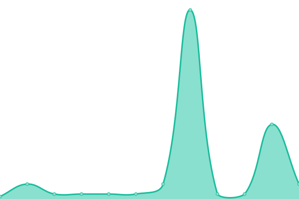

# [📈 Live Status](https://upptime.ryanrosenblatt.com): <!--live status--> **🟧 Partial outage**

This repository contains the open-source uptime monitor and status page for [Ryan](https://upptime.ryanrosenblatt.com), powered by [Upptime](https://github.com/upptime/upptime).

With [Upptime](https://upptime.js.org), you can get your own unlimited and free uptime monitor and status page, powered entirely by a GitHub repository. We use [Issues](https://github.com/ryanmattt/upptime-tracking/issues) as incident reports, [Actions](https://github.com/ryanmattt/upptime-tracking/actions) as uptime monitors, and [Pages](https://upptime.ryanrosenblatt.com) for the status page.

<!--start: status pages-->
<!-- This summary is generated by Upptime (https://github.com/upptime/upptime) -->
<!-- Do not edit this manually, your changes will be overwritten -->
<!-- prettier-ignore -->
| URL | Status | History | Response Time | Uptime |
| --- | ------ | ------- | ------------- | ------ |
|  [Watch Bulbmin](https://watch.bulbmin.com) | 🟩 Up | [watch-bulbmin.yml](https://github.com/ryanmattt/upptime-tracking/commits/HEAD/history/watch-bulbmin.yml) | 

 348ms
     
 | 

<a href="https://upptime.ryanrosenblatt.com/history/watch-bulbmin">100.00%</a>
    

|  [Ryan Rosenblatt Site](https://ryanrosenblatt.com) | 🟩 Up | [ryan-rosenblatt-site.yml](https://github.com/ryanmattt/upptime-tracking/commits/HEAD/history/ryan-rosenblatt-site.yml) | 

 371ms
     
 | 

<a href="https://upptime.ryanrosenblatt.com/history/ryan-rosenblatt-site">100.00%</a>
    

|  [SIMCON Dashboard](https://ursga.com/simcon) | 🟩 Up | [simcon-dashboard.yml](https://github.com/ryanmattt/upptime-tracking/commits/HEAD/history/simcon-dashboard.yml) | 

 277ms
     
 | 

<a href="https://upptime.ryanrosenblatt.com/history/simcon-dashboard">26.00%</a>
    

|  [Nara PvP Minecraft Server](naraclickies.online) | 🟥 Down | [nara-pv-p-minecraft-server.yml](https://github.com/ryanmattt/upptime-tracking/commits/HEAD/history/nara-pv-p-minecraft-server.yml) | 

 5ms
     
 | 

<a href="https://upptime.ryanrosenblatt.com/history/nara-pv-p-minecraft-server">96.64%</a>
    

|  [URSGA Minecraft Server](mc.ursga.com) | 🟩 Up | [ursga-minecraft-server.yml](https://github.com/ryanmattt/upptime-tracking/commits/HEAD/history/ursga-minecraft-server.yml) | 

 5ms
     
 | 

<a href="https://upptime.ryanrosenblatt.com/history/ursga-minecraft-server">100.00%</a>
    

<!--end: status pages-->

[**Visit our status website →**](https://upptime.ryanrosenblatt.com)

## 📄 License

- Powered by: [Upptime](https://github.com/upptime/upptime)
- Code: [MIT](./LICENSE) © [Anand Chowdhary](https://anandchowdhary.com), supported by [Pabio](https://pabio.com)
- Data in the `./history` directory: [Open Database License](https://opendatacommons.org/licenses/odbl/1-0/)
